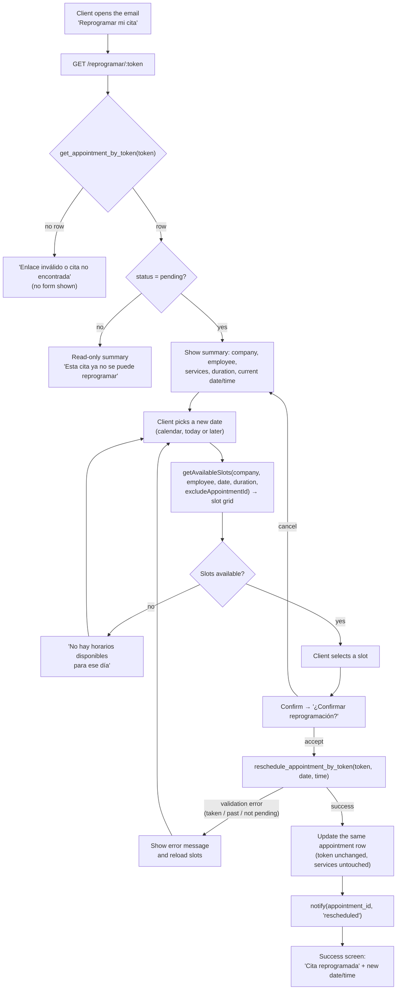
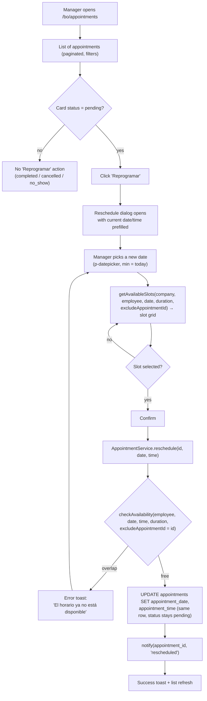

## Why

Neither clients nor staff can change an appointment's date/time: the only mutation paths are create, cancel, complete, no-show and service edits. Moving a booking therefore means cancelling and re-booking, which loses the original record and forces the client to re-enter their data. The database already carries a `cancellation_token` documented as "token para cancelar/**reprogramar** sin login" (`supabase/01-tables.sql:155`) and the confirmation email already emits a management link, but no route, policy or RPC backs it — the emailed link is dead today.

## What Changes

- **New public page `/reprogramar/:token`** where a client opens their appointment from the emailed link, picks a new date and slot, and confirms. Read and write go through token-scoped RPCs, so no anonymous table access is widened.
- **Two `SECURITY DEFINER` RPCs** in a new Supabase migration: `get_appointment_by_token(p_token)` (appointment + services + company/employee for the page) and `reschedule_appointment_by_token(p_token, p_date, p_time)` (validates status/date/overlap and writes atomically).
- **Token confidentiality fix (security)**: `cancellation_token` is currently readable by anonymous clients through `appointments_select_public` + `select('*')`, which would make any token-based reschedule hijackable. The public read path moves to an explicit column list and `SELECT (cancellation_token)` is revoked from `anon`.
- **Manager reschedule action** on `/bo/appointments`: a "Reprogramar" button on pending appointment cards opens a reschedule dialog (date + available slot grid) modelled on the existing create dialog, then refreshes the list.
- **`AppointmentService`**: new `reschedule(appointmentId, date, time)` (availability-checked, excludes the appointment itself) and an `excludeAppointmentId` parameter on `getAvailableSlots()` so a reschedule does not see its own slot as busy.
- **New `rescheduled` email event** in `send-appointment-email` (client + employee + managers) carrying the new date/time and the management link; the dead `/cancelar/{token}` line in the confirmation email is replaced by the working reschedule link.
- **Tests** (behavior-oriented, jest + Testing Library) for the service methods, the public page and the manager dialog, plus OpenSpec specs for the new capability.

## Flows

### Client flow (anonymous, token from the confirmation email)

### Manager flow (authenticated, `/bo/appointments`)

## Capabilities

### New Capabilities
- `appointment-reschedule`: token-based client reschedule page and RPCs, manager reschedule action and service method, status/availability rules shared by both flows, token secrecy, and the `rescheduled` notification.

### Modified Capabilities
- `slot-availability`: availability calculation gains an optional excluded appointment, so the appointment being rescheduled does not block its own slots.

## Impact

- **Database** (new migration `supabase/migrations/2026XXXX_add_appointment_reschedule_rpcs.sql`): `get_appointment_by_token`, `reschedule_appointment_by_token` (both `SECURITY DEFINER`, `GRANT EXECUTE` to `anon, authenticated`), and `REVOKE SELECT (cancellation_token) ON appointments FROM anon`. No table or column additions; no data migration.
- **Frontend**: new `app-web/src/app/features/public/reschedule-appointment/` page + route in `app.routes.ts`; `core/services/appointment.service.ts` (`reschedule`, `getAvailableSlots` exclusion, explicit column list in `getByEmployee`); `core/models/email-notification.model.ts` (`EmailEventType`); manager `appointments.component.*` (action + dialog) and a new `manager-appointment-reschedule-dialog.component.*`.
- **Backend**: `backend/send-appointment-email/index.ts` (new `rescheduled` event, label/color, email copy, management link).
- **Security posture**: an anonymous client can only touch the single appointment whose token they hold, and only while it is `pending`; the token stops being world-readable. The pre-existing gaps (no DB-level double-booking constraint, availability degraded for anonymous callers because `appointment_services` has no anon SELECT policy, dead `/cancelar/:token` link) are documented as out of scope.
- **Not breaking**: existing booking, cancellation, payment and service-edit flows keep their current behaviour; no existing RPC or policy is modified other than the token column grant.
